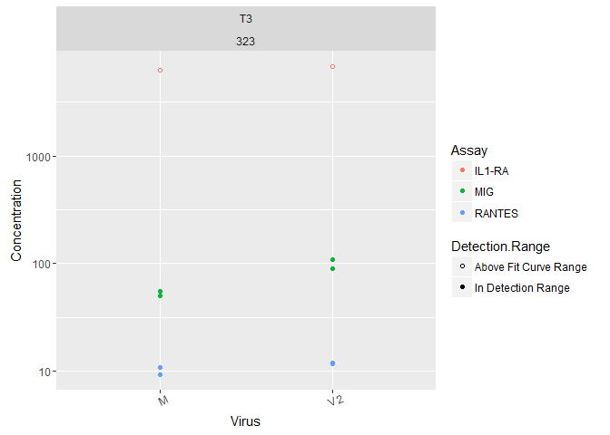
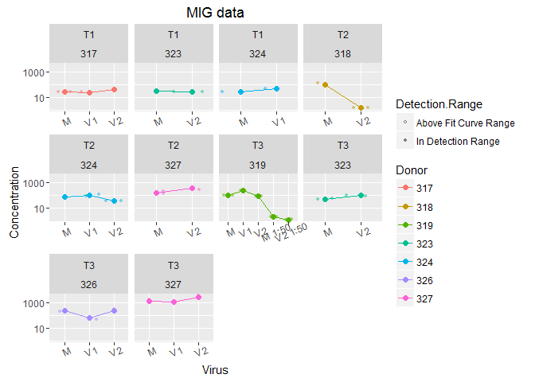
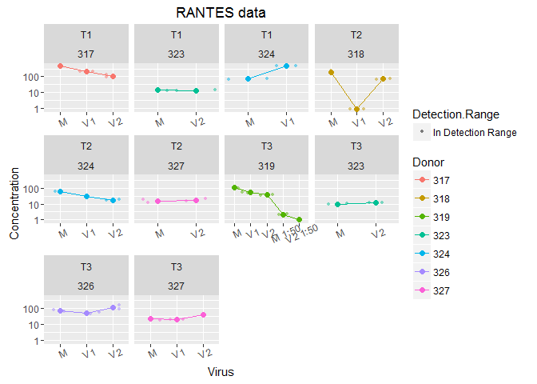
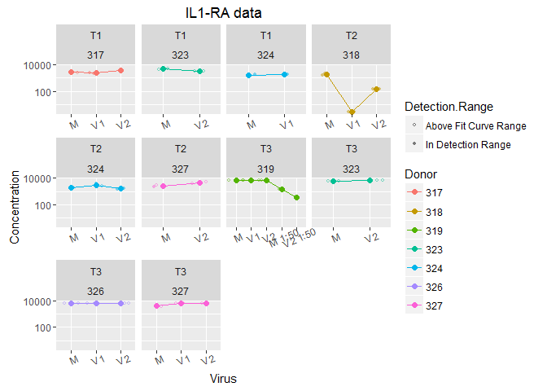

30June16 explant sups plate 3: MIG, RANTES, IL1ra
================
Claire Levy
July 6, 2016

This is an analysis of data from running our MSD plate 3 on some of the HSV2 infected explant sup samples for Herpes P01. See "explant\_and\_HVE\_cell\_sup\_MSD\_README.txt"" for more on the different plates/analyte panels. This plate has the following analytes measured in each well

Plate 3: 96 well 4 spot prototype Human Triplex

    Il-1ra
    MIG (CXCL9)
    RANTES (CCL5)

Of the 48 standards that we measured, 37 are in the detection range. The following standards were out of the detection range:

<table style="width:53%;">
<colgroup>
<col width="12%" />
<col width="11%" />
<col width="29%" />
</colgroup>
<thead>
<tr class="header">
<th align="center">Sample</th>
<th align="center">Assay</th>
<th align="center">Detection.Range</th>
</tr>
</thead>
<tbody>
<tr class="odd">
<td align="center">STD-01</td>
<td align="center">IL1-RA</td>
<td align="center">Above Fit Curve Range</td>
</tr>
<tr class="even">
<td align="center">STD-01</td>
<td align="center">IL1-RA</td>
<td align="center">Above Fit Curve Range</td>
</tr>
<tr class="odd">
<td align="center">STD-08</td>
<td align="center">IL1-RA</td>
<td align="center">Below Fit Curve Range</td>
</tr>
<tr class="even">
<td align="center">STD-08</td>
<td align="center">IL1-RA</td>
<td align="center">Below Fit Curve Range</td>
</tr>
<tr class="odd">
<td align="center">STD-01</td>
<td align="center">MIG</td>
<td align="center">Above Fit Curve Range</td>
</tr>
<tr class="even">
<td align="center">STD-08</td>
<td align="center">MIG</td>
<td align="center">Below Fit Curve Range</td>
</tr>
<tr class="odd">
<td align="center">STD-08</td>
<td align="center">MIG</td>
<td align="center">Below Fit Curve Range</td>
</tr>
<tr class="even">
<td align="center">STD-01</td>
<td align="center">RANTES</td>
<td align="center">Above Fit Curve Range</td>
</tr>
<tr class="odd">
<td align="center">STD-01</td>
<td align="center">RANTES</td>
<td align="center">Above Fit Curve Range</td>
</tr>
<tr class="even">
<td align="center">STD-08</td>
<td align="center">RANTES</td>
<td align="center">Below Fit Curve Range</td>
</tr>
<tr class="odd">
<td align="center">STD-08</td>
<td align="center">RANTES</td>
<td align="center">Below Fit Curve Range</td>
</tr>
</tbody>
</table>

Here is a plot of the % recovery (extrapolated concentration/ known concentration x 100) for the standards that were either within or above the detection range, with lines at the "good recovery" limits of 80 and 120% recovery.

The R-squared values for goodness-of-fit were good for all assays:

<table style="width:26%;">
<colgroup>
<col width="11%" />
<col width="15%" />
</colgroup>
<thead>
<tr class="header">
<th align="center">Assay</th>
<th align="center">R_Squared</th>
</tr>
</thead>
<tbody>
<tr class="odd">
<td align="center">IL1-RA</td>
<td align="center">0.9999910</td>
</tr>
<tr class="even">
<td align="center">MIG</td>
<td align="center">0.9998396</td>
</tr>
<tr class="odd">
<td align="center">RANTES</td>
<td align="center">0.9999134</td>
</tr>
</tbody>
</table>

Caveats
-------

Some data points were above the range of the curve fit. The MSD software can extrapolate values for these if the curve is linear at the top. Values cannot be extrapolated when the data was below the fit curve range, so those are not shown in the following plots.

When we analyzed the explant microarray data, we saw the most obvious differences in gene expression were in V2T3 for donors 323,317,324,318. The only sample that was in this subset that we ran on this plate was 323.

Data separated by analyte:

