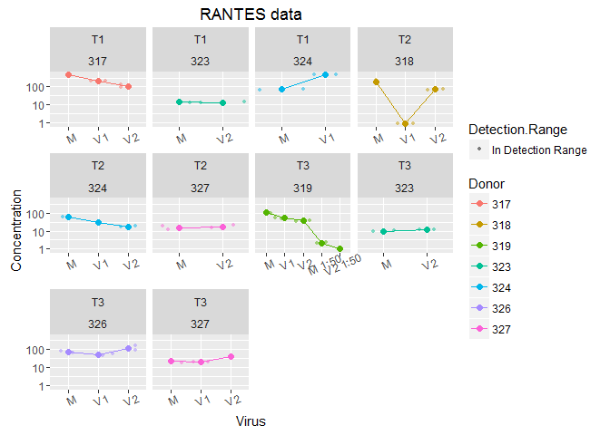
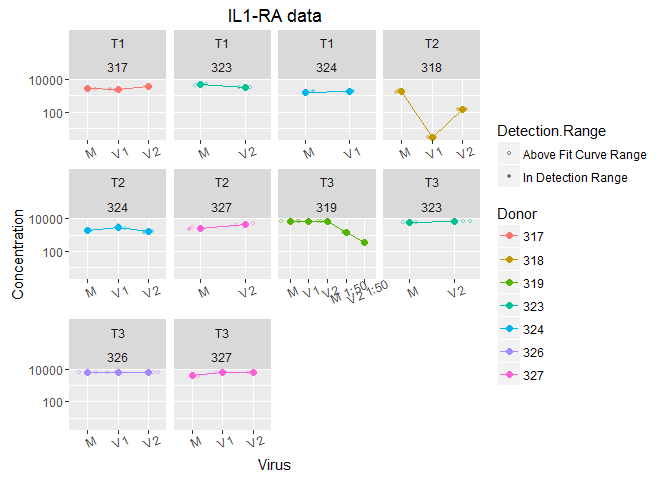

30June16 explant sups plate 3: MIG, RANTES, IL1ra
================
Claire Levy
July 6, 2016

This is an analysis of data from running our MSD plate 3 on some of HSV2 infected explant sup samples for Herpes P01. See explant\_and\_HVE\_cell\_sup\_MSD\_README for more on the different plates/analyte panels. This plate has the following analytes measured in each well

Plate 3: 96 well 4 spot prototype Human Triplex

    Il-1ra
    MIG (CXCL9)
    RANTES (CCL5)

The MSD machine gives the data in an excel or text format. I have .csv file with the results.

Of the 26 standards that we measured, 26 are in the detection range. The following standards were out of the detection range:

<table style="width:85%;">
<colgroup>
<col width="12%" />
<col width="12%" />
<col width="11%" />
<col width="30%" />
<col width="18%" />
</colgroup>
<thead>
<tr class="header">
<th align="center">Type</th>
<th align="center">Sample</th>
<th align="center">Assay</th>
<th align="center">Detection.Range</th>
<th align="center">X..Recovery</th>
</tr>
</thead>
<tbody>
<tr class="odd">
<td align="center">Standard</td>
<td align="center">STD-01</td>
<td align="center">IL1-RA</td>
<td align="center">Above Fit Curve Range</td>
<td align="center">103.3</td>
</tr>
<tr class="even">
<td align="center">Standard</td>
<td align="center">STD-01</td>
<td align="center">IL1-RA</td>
<td align="center">Above Fit Curve Range</td>
<td align="center">100.8</td>
</tr>
<tr class="odd">
<td align="center">Standard</td>
<td align="center">STD-08</td>
<td align="center">IL1-RA</td>
<td align="center">Below Fit Curve Range</td>
<td align="center">NA</td>
</tr>
<tr class="even">
<td align="center">Standard</td>
<td align="center">STD-08</td>
<td align="center">IL1-RA</td>
<td align="center">Below Fit Curve Range</td>
<td align="center">NA</td>
</tr>
<tr class="odd">
<td align="center">Standard</td>
<td align="center">STD-01</td>
<td align="center">MIG</td>
<td align="center">Above Fit Curve Range</td>
<td align="center">100</td>
</tr>
<tr class="even">
<td align="center">Standard</td>
<td align="center">STD-08</td>
<td align="center">MIG</td>
<td align="center">Below Fit Curve Range</td>
<td align="center">NA</td>
</tr>
<tr class="odd">
<td align="center">Standard</td>
<td align="center">STD-08</td>
<td align="center">MIG</td>
<td align="center">Below Fit Curve Range</td>
<td align="center">NA</td>
</tr>
<tr class="even">
<td align="center">Standard</td>
<td align="center">STD-01</td>
<td align="center">RANTES</td>
<td align="center">Above Fit Curve Range</td>
<td align="center">106.9</td>
</tr>
<tr class="odd">
<td align="center">Standard</td>
<td align="center">STD-01</td>
<td align="center">RANTES</td>
<td align="center">Above Fit Curve Range</td>
<td align="center">107</td>
</tr>
<tr class="even">
<td align="center">Standard</td>
<td align="center">STD-08</td>
<td align="center">RANTES</td>
<td align="center">Below Fit Curve Range</td>
<td align="center">NA</td>
</tr>
<tr class="odd">
<td align="center">Standard</td>
<td align="center">STD-08</td>
<td align="center">RANTES</td>
<td align="center">Below Fit Curve Range</td>
<td align="center">NA</td>
</tr>
</tbody>
</table>

Here is a plot of the % recovery (extrapolated concentration/ known concentration x 100) for the standards that were in the detection range, with lines at the "good recovery" limits of 80 and 120% recovery.

The R-squared values for goodness-of-fit were good for all assays:

<table style="width:26%;">
<colgroup>
<col width="11%" />
<col width="15%" />
</colgroup>
<thead>
<tr class="header">
<th align="center">Assay</th>
<th align="center">R_Squared</th>
</tr>
</thead>
<tbody>
<tr class="odd">
<td align="center">IL1-RA</td>
<td align="center">0.9999910</td>
</tr>
<tr class="even">
<td align="center">MIG</td>
<td align="center">0.9998396</td>
</tr>
<tr class="odd">
<td align="center">RANTES</td>
<td align="center">0.9999134</td>
</tr>
</tbody>
</table>

MIG data

RANTES data

IL1-RA data

