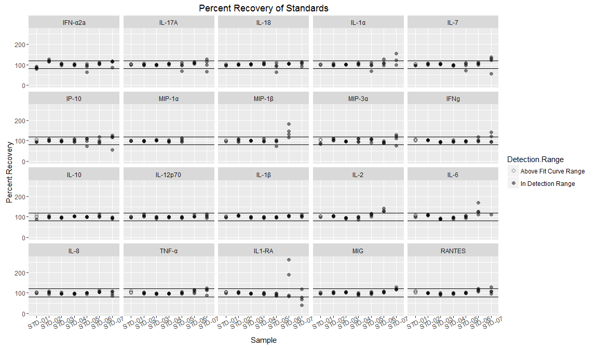

MSD panels 1, 2 and 3 HVE Supernatant
================

Experiment overview
-------------------

These data are from running MSD analysis of supernatents from selected ex vivo vaginal epithelial cells from three donors. The explants were infected with HSV2 strains 186, SD90 or Mock infected by Lamar Fleming and Gabriella Fenkart and supernatents were collected at 3 timepoints post-infection: 3hrs, 8hrs and 24hrs.

We used 3 different MSD panels containing a total of 20 analytes analyzed for 24 samples. Based on results from running test samples and from running the explant supernatent samples, we decided to dilute all the supernants 1:2 (plate 1) and 1:5 (plate 2) with MSD's diluent 43 before running the plates. All samples were run in duplicate.

Checking Standard Recovery and Curves
-------------------------------------

Here are plots of the % recovery (extrapolated concentration/ known concentration x 100) for the standards that were either within or above the detection range, with lines at the "good recovery" limits of 80 and 120% recovery.

The R2 values for goodness-of-fit for the standard curves were all &gt;0.99

Caveats about Standards
-----------------------

-   Standards with values *below the detection range* (&lt;2.5x the standard deviation of the lowest standard) give unreliable concentrations, so I did not include those in the plots.

-   When standards are *below the curve fit* (outside the range of the standard curve), the software does not calculate concentrations so you can't get a percent recovery.

-   Most of the Standards that fell into either of these categories were from STD-07 or STD-08 except for five that were STD-06:

<table style="width:53%;">
<colgroup>
<col width="12%" />
<col width="40%" />
</colgroup>
<thead>
<tr class="header">
<th align="center">Sample</th>
<th align="center">Number of Samples Below Fit Curve Range/Detection Range</th>
</tr>
</thead>
<tbody>
<tr class="odd">
<td align="center">STD-06</td>
<td align="center">5</td>
</tr>
<tr class="even">
<td align="center">STD-07</td>
<td align="center">16</td>
</tr>
<tr class="odd">
<td align="center">STD-08</td>
<td align="center">80</td>
</tr>
</tbody>
</table>

HVE Supernatents: Detection Range
---------------------------------

The following plots show that the 1:2 dilution of the samples resulted in more samples being in "In Detection Range."

Estimated Sample Concentration Distribution
-------------------------------------------

-   I multiplied by the dilution factors so this is an estimated concentration of the stock samples.

-   Note that this is on a log(10) scale; most concentrations are a lot lower than the high ones.

Samples are multiplied by their dilution factor to get estimated concentrations.

If a sample had one rep that was below detection and another that was in range, I used the remaining "in range" rep as the "average" for that sample.

Here is the same heat map with some changes to to Assay names and order:

