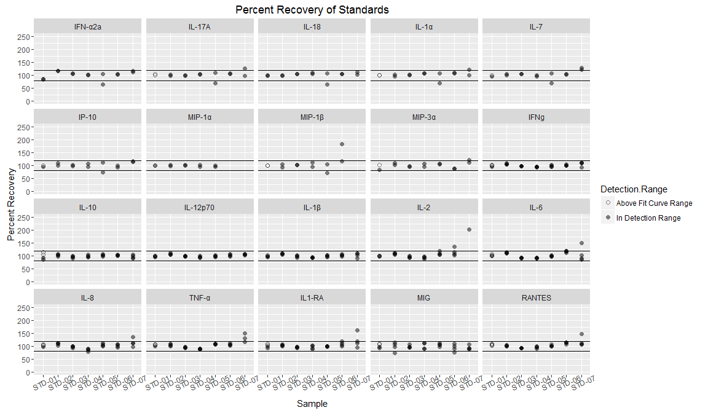

MSD panels 1, 2 and 3 Explant Supernatant
================

Experiment overview
-------------------

These data are from running MSD analysis of supernatents from selected vaginal explant samples from seven donors. The explants were infected with HSV2 strains 186, SD90 or Mock infected by Lamar Fleming and Gabriella Fenkart and supernatents were collected at 3 timepoints post infection: 3hrs, 8hrs and 24hrs.

We used 3 different MSD panels containing a total of 20 analytes analyzed for 46 samples (see caveat). Based on results from running test samples, we decided to dilute all the supernants 1:5 with MSD's diluent 43 before running the plates. All samples (except 1, see caveats) were run in duplicate.

Caveats
-------

Due to limited sample volume, we had to make the following omissions:

Panel 2: Only 1 rep for sample 324-T2-V1

Panel 3: Did not run samples 324-T2-V1 or 324-T2-V2.

Due to a possible pipetting error, we were not able to use the data from the standards that we ran for panel 1. Instead, we used the standards from a different run of the same panel to calculate concentrations for the experimental samples (see explant\_sup\_README for details).

Checking Standard Recovery and Curves
-------------------------------------

Here are plots of the % recovery (extrapolated concentration/ known concentration x 100) for the standards that were either within or above the detection range, with lines at the "good recovery" limits of 80 and 120% recovery.

The R2 values for goodness-of-fit for the standard curves were all &gt;0.99

Caveats about Standards
-----------------------

-   Standards with values *below the detection range* (&lt;2.5x the standard deviation of the lowest standard) give unreliable concentrations, so I did not include those in the plots.

-   When standards are *below the curve fit* (outside the range of the standard curve), the software does not calculate concentrations so you can't get a percent recovery.

-   Most of the Standards that fell into either of these categories were from STD-07 or STD-08 except for two that were STD-06:

<table style="width:53%;">
<colgroup>
<col width="12%" />
<col width="40%" />
</colgroup>
<thead>
<tr class="header">
<th align="center">Sample</th>
<th align="center">Number of Samples Below Fit Curve Range/Detection Range</th>
</tr>
</thead>
<tbody>
<tr class="odd">
<td align="center">STD-06</td>
<td align="center">2</td>
</tr>
<tr class="even">
<td align="center">STD-07</td>
<td align="center">8</td>
</tr>
<tr class="odd">
<td align="center">STD-08</td>
<td align="center">62</td>
</tr>
</tbody>
</table>

Explant Supernatents: Detection Range
-------------------------------------

Estimated Sample Concentration Distribution
-------------------------------------------

-   I multiplied by the dilution factor so this is an estimated concentration of the stock samples.

-   Note that this is on a log(10) scale; most concentrations are a lot lower than the high ones.

Plots of Analyte Concentrations by Donor, Timepoint and Condition
-----------------------------------------------------------------

We did a 1:5 dilution of the samples so I multiplied the concentrations by 5 to get an estimate of the stock supernatent concentration.

If a sample had one rep that was below detection and another that was in range, I used the remaining "in range" rep as the "average" for that sample.

This is just donors 317,318,323 and 324, which were interesting in the microarray

